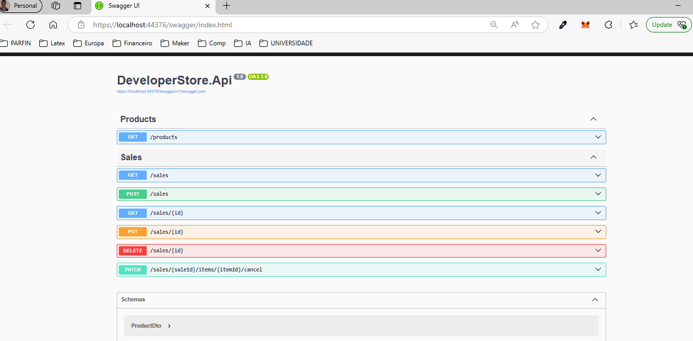
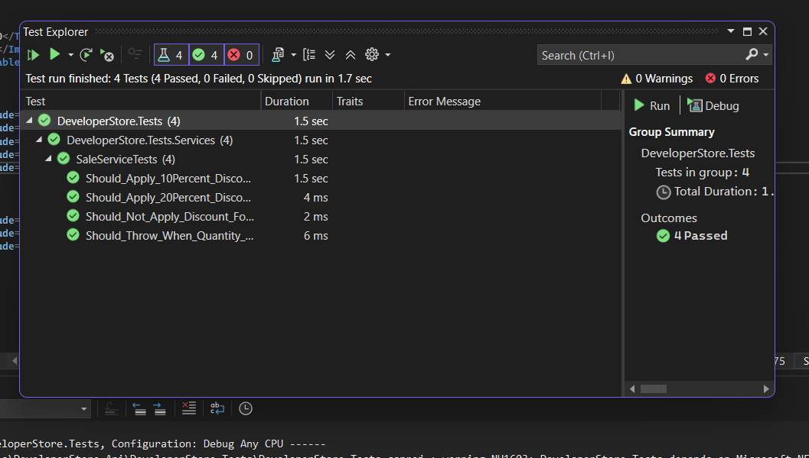

# 🛍️ DeveloperStore API

### Sales Registration System built with DDD

This is a RESTful API developed with **.NET 8**, following **Domain-Driven Design (DDD)** principles. It simulates a complete sales registration system with business rules, domain events, filters, ordering, and pagination.

---

## 🚀 Features

### 🧾 Sales (`/sales`)
- Full CRUD operations
- Each sale includes:
  - Sale number
  - Customer
  - Branch
  - Date
  - Cancelled / Not cancelled
  - Items: product, quantity, unit price, discount
- **Automatic application of business rules**:
  - 10% discount for 4+ items
  - 20% discount for 10–20 items
  - Max 20 identical items allowed

### 🛒 Products (`/products`)
- Product list derived from sale items (denormalized)
- Supports:
  - Filtering by `title`, `category`, `price`, `_minPrice`, `_maxPrice`
  - Wildcard filtering (e.g., `title=Mouse*`)
  - Multi-field ordering (e.g., `_order=price desc, title asc`)
  - Format aligned with FakeStoreAPI

### 📣 Domain Events (logged)
- `SaleCreatedEvent`
- `SaleModifiedEvent`
- `SaleCancelledEvent`
- `ItemCancelledEvent`

> Events are logged via a `IDomainEventDispatcher` implementation, simulating an event-driven architecture.

---

## 📚 Swagger Documentation



Below is a sample POST request using Swagger:

```json
{
  "saleNumber": "SALE-2025-0001",
  "date": "2025-04-11T15:30:00Z",
  "customerName": "CHRISTOPHER",
  "branchName": "Curitiba - Centro",
  "cancelled": false,
  "items": [
    {
      "productName": "Notebook Dell Inspiron",
      "quantity": 5,
      "unitPrice": 3500.00,
      "discount": 1750.00
    },
    {
      "productName": "Mouse Logitech M185",
      "quantity": 2,
      "unitPrice": 80.00,
      "discount": 0.00
    }
  ]
}```

## ✅ Testing



- **xUnit** for unit testing  
- **NSubstitute** for mocking  
- **Bogus** for realistic fake data  

### Covered Scenarios:
- Business rules (discount tiers, quantity limits)
- Sale creation and updates
- Domain event dispatching

```bash
dotnet test


